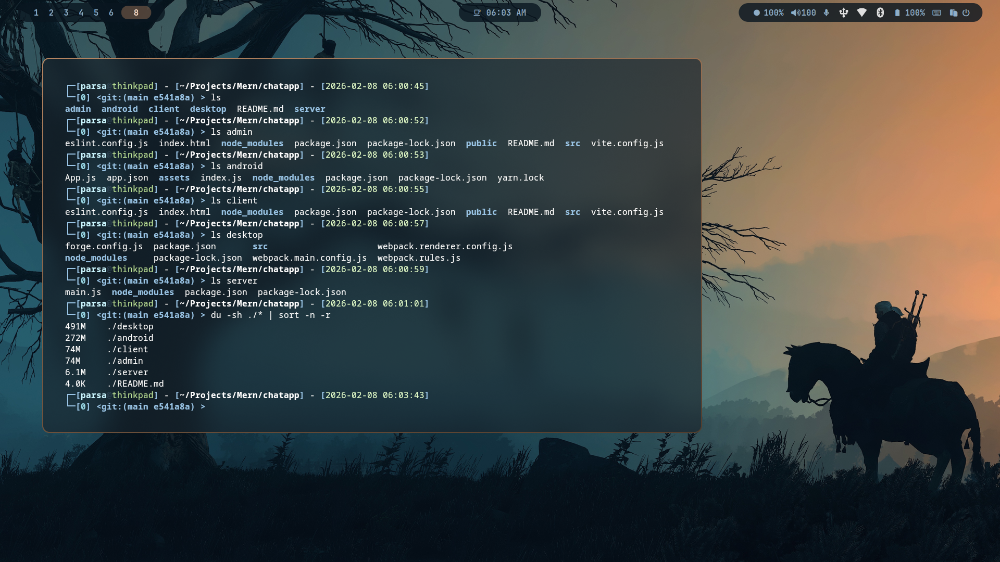

# Full stack chat app with .JS

- ReactJS => admin , client
- ReactNative => android
- ElectronJs ( React ) => desktop ( win , lin , mac )
- NodeJs ( Expressjs ) => server

**Admin , Client**

> React

    npm run dev

**Android , Desktop**

> ReactNative , ReactElectron

    npm run start

**Server**

> Node , Express

    npm run dev

**My Skills**

> React , ReactNative
> ElectronJs
> Nodejs
> vim , linux , git

